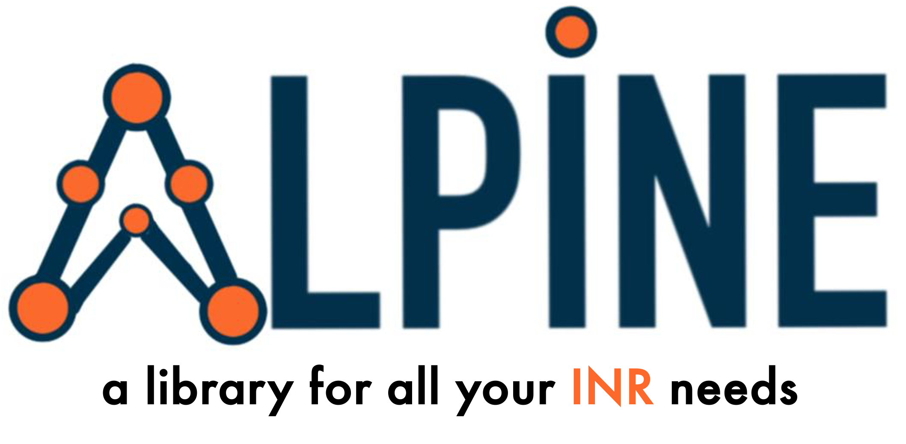

## Alpine - A PyTorch Library for Implicit Neural Representations

Welcome to Alpine! We provide an easy and extensible way to rapidly prototype implicit neural representations or neural fields (INRs) in PyTorch. Alpine offers modular and object-oriented interfaces allowing you to get started with INRs from the get go. We provide clean interfaces minimizing overhead and boilerplate code. 

Alpine also offers a powerful visualization library that helps you take a peek under the hood. We provide interpretable visualizations such as PCA of learned features, gradient monitoring and histograms, . We also integrate the Implict Neural Canvas[cite] by Padmanabhan et.al.

> [!IMPORTANT]
> Alpine is work in progress. We appreciate any constructive community feedback and support. We invite all the researchers across all disciplines to explore, and suggest any features you find particularly useful. Our goal is to make `Alpine` the go-to place for scientific computing using INRs!

## Setup instructions

    git clone git@github.com:kushalvyas/alpine.git
    cd alpine/
    pip install . # or pip install -e . (if you want to experiemnt or edit the library, this makes the codebase editable)

## Examples

We provide extensive examples across the tasks of 
- Audio (1-D)
- Images (2-D) 
- Volumes (3-D) fitting
- 3D Protein structure modelling (using the RCSB protein databank)
- Fitting gigapixel signals (using MINER)
- Representing hyperspectral volumes
- Solving phase recovery in optics (inverse problem)
- Solving CT reconstruction from sparse measurements (inverse problem)

## Citation

If you find Alpine useful, please consider citing us!
    
    @software{vyas_alpine_2025
        author={ Vyas, Kushal and Saragadam, Vishwanath and Veeraraghavan, Ashok and Balakrishnan, Guha},
        title = {Alpine - A PyTorch Library for Implicit Neural Representations},
        year={2025},
        url={https://github.com/kushalvyas/alpine}
    }